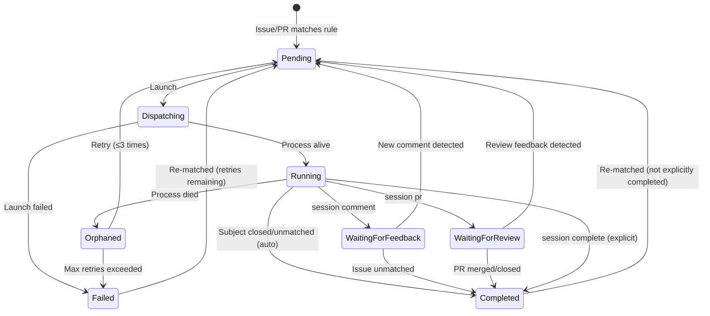

# copilotd

**copilotd** is an orchestration daemon that watches GitHub repos for issues and pull requests matching configurable dispatch rules and automatically spawns remote-enabled [Copilot CLI](https://docs.github.com/copilot/how-tos/copilot-cli) sessions to work on them.

Instead of waiting for a developer to open a terminal and manually engage Copilot, copilotd continuously monitors your repositories. When an issue or pull request matches your rules, it automatically dispatches a Copilot CLI agent, creates an isolated worktree, asks clarifying questions via comments, writes or reviews code, opens or updates PRs, and responds to PR review feedback. All without human intervention.

copilotd sits between GitHub Issues, pull requests, and the Copilot CLI running on your dev machine, acting as an always-on orchestration layer.

Available for Windows, macOS, and Linux.

## Watch the introduction video

[](https://www.youtube.com/watch?v=zT6N_l12ofU)

## Features

- **Issue watching** — polls GitHub repos for issues matching configurable rules (assigned user, labels, milestone, issue type)
- **PR watching** — opt-in pull request rules can dispatch review, validation, or follow-up sessions using PR metadata (labels, assignee, base/head branch, draft state, review decision)
- **Automatic dispatch** — launches `copilot --remote` sessions with templated prompts derived from issue or PR metadata
- **Terminal-safe automation** — dispatched work sessions suppress browser launch environment variables so unattended agents stay in terminal/API workflows instead of popping open web pages
- **Named dispatch rules** — flexible, composable rules with per-rule launch options (`--yolo`, `--allow-all-tools`, `--allow-all-urls`, `--model`, extra prompts, repo assignments)
- **Session lifecycle** — full state machine with retry, backoff, orphan recovery, investigation feedback loops, PR review monitoring, and explicit completion signaling
- **PR review feedback** — sessions that create PRs can wait for review comments and automatically re-dispatch to address feedback
- **Self-healing state** — reconciles persisted state, live process status, and GitHub issue matches on every poll cycle and at startup
- **Crash-resilient** — dispatched `copilot` sessions run as independent processes that survive daemon restarts; state is persisted atomically
- **Interactive connection** — connect to any running remote-enabled session with `copilotd session connect` without stopping the orchestrated session (requires Copilot CLI 1.0.32+)
- **Remote control session** — hosts a `copilot --remote` session for remotely managing copilotd via the GitHub remote sessions UI (web & mobile)
- **Cross-platform** — works on Windows, macOS, and Linux

## Getting started

### Prerequisites

- [GitHub CLI (`gh`)](https://cli.github.com/) — authenticated via `gh auth login`
- [Copilot CLI (`copilot`)](https://docs.github.com/copilot/how-tos/copilot-cli) — authenticated via `copilot login`

### Install on Windows

In a PowerShell terminal:

```PowerShell
irm https://copilotd.damianedwards.dev/install.ps1 | iex
```

### Install on macOS & Linux

In a terminal:

```bash
curl -sSL https://copilotd.damianedwards.dev/install.sh | bash
```

or

```bash
wget -qO- https://copilotd.damianedwards.dev/install.sh | bash
```

## Running

Run `copilotd init` to configure watched repos then run `copilotd run` to start the daemon.

The `init` command is an interactive wizard that walks you through:
1. **Dependency & auth checks** — verifies `gh` and `copilot` CLIs are installed (showing versions) and authenticated
2. **Repo home** — where your repository clones live on disk
3. **Global settings** — max concurrent sessions, default model
4. **Dispatch sources** — choose whether to dispatch from issues, pull requests, or both
5. **Default issue and/or PR rules** — author filtering, required labels, tool permissions (yolo/allow-all-tools/allow-all-urls), model override, plus PR-specific branch settings when PR dispatch is enabled
6. **Repository selection** — pick which repos to watch (shows clone status)
7. **Folder trust checks** — for cloned repos, prompts to add the repo path and daemon worktree root to Copilot's trusted folders when needed for unattended dispatch

After setup, a configuration summary and concrete next-step commands are displayed.

Run `copilotd --help` for other commands.

## Building from source

### Prerequisites 

- [.NET 10 SDK](https://dotnet.microsoft.com/download/dotnet/10.0)

```bash
# Clone and build
git clone https://github.com/DamianEdwards/copilotd.git
cd copilotd
./build.sh               # macOS/Linux
.\build.ps1              # Windows PowerShell / pwsh
build.cmd                # Windows cmd.exe

# First-run setup (checks dependencies, prompts for config)
./copilotd.sh init          # macOS/Linux
.\copilotd.ps1 init         # Windows PowerShell / pwsh
copilotd.cmd init           # Windows cmd.exe

# Start the daemon
./copilotd.sh run           # macOS/Linux
.\copilotd.ps1 run          # Windows PowerShell / pwsh
copilotd.cmd run            # Windows cmd.exe
```

Convenience scripts `copilotd.sh`, `copilotd.ps1`, and `copilotd.cmd` run the project from source without rebuilding on every invocation. They default `COPILOTD_HOME` to a repo-local `.copilotd-home` folder so source runs stay isolated from a global install, while still honoring an explicitly configured `COPILOTD_HOME`. For the long-lived `run` command they execute the existing generated apphost directly so Ctrl+C reaches `copilotd` cleanly. Build it first with `build.sh`, `build.ps1`, or `build.cmd`. On Windows, use `copilotd.ps1` from PowerShell and `copilotd.cmd` from cmd.exe; other commands continue to use `dotnet run --no-build`, passing all arguments through.

Installed copilotd binaries can self-update in the background: the daemon checks for newer releases, downloads and verifies them, then stages the new binary to be installed after the running daemon exits naturally. If an installed binary update is interrupted and you restore `copilotd.exe` by rerunning the normal install script, the next copilotd launch will reconcile any leftover `.old`, `.staged`, and `update-state.json` artifacts: it will resume a newer staged update, or discard stale staged state rather than downgrading the restored binary. When running from source or a local repo publish, copilotd suppresses automatic background self-updates by default so local scenario verification is not interrupted by GitHub releases. You can still disable them explicitly with `COPILOTD_DISABLE_SELF_UPDATES=1` or `--disable-self-updates`, and `copilotd update --check` remains available to inspect update availability.

## Commands

| Command | Description |
|---------|-------------|
| `copilotd init` | Interactive first-run wizard (dependency checks with versions, auth, global config, rule setup, repo selection) |
| `copilotd run` | Start the polling daemon and print the current daemon log folder |
| `copilotd start` | Start the daemon in the background and print the current daemon log folder |
| `copilotd stop` | Stop the daemon and print the current daemon log folder |
| `copilotd status` | Show daemon health, machine identity, watched repos, the active daemon log folder, and the session list |
| `copilotd logs` | Print the copilotd logs directory (`copilotd log` also works) |
| `copilotd logs clear [--days <n>]` | Clear log files, optionally only those older than the supplied age |
| `copilotd session` | List dispatched sessions with their remote session URLs (`copilotd sessions` also works; default alias for `session list`) |
| `copilotd session list` | List dispatched sessions with optional filtering and remote session URLs |
| `copilotd session info <issue>` | Show detailed diagnostic information for a tracked session, including failure details when available |
| `copilotd session connect <issue>` | Connect to a running remote session interactively |
| `copilotd session comment <issue>` | Post a comment on the issue and wait for feedback (callable from within a copilot session) |
| `copilotd session complete <issue>` | Mark a session as completed (callable from within a copilot session) |
| `copilotd session pr <pr-number> <issue>` | Associate a PR with a session and wait for review feedback (callable from within a copilot session) |
| `copilotd session reset <issue>` | Reset a completed/failed session to pending for re-dispatch |
| `copilotd config` | Display current configuration |
| `copilotd config --set key=value` | Set a config value (`repo_home`, `default_model`, `custom_prompt`, `session_name_format`, `current_user`, `enable_control_session`, `max_instances`, `session_shutdown_delay_seconds`) |
| `copilotd rules list` | List all dispatch rules (`copilotd rule list` also works) |
| `copilotd rules add <name>` | Add a new issue dispatch rule (`copilotd rule create <name>` and `copilotd rule new <name>` also work); use `--kind pr` for pull request rules |
| `copilotd rules update <name>` | Update an existing rule (`copilotd rule edit <name>` also works) |
| `copilotd rules delete <name>` | Delete a rule (the `Default` rule cannot be deleted) |

File logs live under `~/.copilotd/logs` by default (or `COPILOTD_HOME/logs`). Each daemon `run` instance gets its own `daemon_<uuid>` subfolder so its log files stay grouped together, while non-daemon commands log directly in the root logs directory with the same rolling-file behavior.

### Run options

```
--interval <seconds>   Polling interval (default: 60)
--log-level <level>    Enable console logging (debug, info, warning, error)
```

### Status & session options

```
--filter <status>   Filter by status (pending, dispatching, running, waitingforfeedback, waitingforreview, completed, failed, orphaned, joined [legacy])
--all               Include ended (completed/failed) sessions
```

### Rules options

Issue rules support conditions (`--assignee`, `--label`, `--milestone`, `--type`) and launch options (`--yolo`, `--allow-all-tools`, `--allow-all-urls`, `--model`, `--prompt`, `--custom-prompt`, `--custom-prompt-mode`, `--repo`). `--yolo` is Copilot CLI's full auto-approval mode and implies all tool, path, and URL permissions. Pull request rules are opt-in with `--kind pr` and support PR-specific conditions (`--base`, `--head`, `--head-repo`, `--draft`, `--review-decision`) plus `--branch-strategy`. All conditions are logical AND. `copilotd init` asks whether to create a default issue rule, a default PR rule, or both.

Aliases: `rule` for `rules`, `create`/`new` for `add`, and `edit` for `update`.

```bash
# Add a rule
copilotd rules add "Dashboard issues" --label area-dashboard --yolo --repo "org/repo"

# Add a rule that uses a specific model
copilotd rules add "Complex tasks" --label complexity-high --model "claude-sonnet-4"

# Add a rule with a per-rule custom prompt that overrides the global custom prompt
copilotd rules add "Backend" --label area-backend --custom-prompt "Focus on API design" --custom-prompt-mode override

# Add a PR review/validation rule
copilotd rules add "PR validation" --kind pr --label needs-validation --base main --branch-strategy read-only --repo "org/repo"

# Update labels on a rule
copilotd rules update Default --delete-label copilotd --add-label dispatch

# Add/remove repos from a rule
copilotd rules update Default --add-repo "org/repo" --delete-repo "org/old-repo"

# Only dispatch issues from specific authors
copilotd rules add "Trusted" --add-author TimMan --add-author Rachael --repo "org/repo"

# Only dispatch issues from authors with write access to the repo
copilotd rules add "WriteOnly" --write-only-authors --repo "org/repo"

# Update a rule to allow any author (clears author restrictions)
copilotd rules update "Trusted" --any-author

# Add/remove allowed authors on an existing rule
copilotd rules update "Trusted" --add-author NewUser --delete-author OldUser
```

### Prompt templating

The built-in prompt and `session_name_format` support token replacement:

| Token | Value |
|-------|-------|
| `$(issue.repo)` | Repository in `org/repo` format |
| `$(issue.id)` | Issue number |
| `$(issue.type)` | Issue type (e.g., `bug`) |
| `$(issue.milestone)` | Milestone title |
| `$(subject.id)` | Root issue or pull request number |
| `$(subject.kind)` | Root subject kind (`issue` or `pullrequest`) |
| `$(subject.title)` | Root subject title when available |
| `$(pr.id)` | Pull request number (the root PR for PR-dispatched sessions, or the review PR for issue-owned PR review prompts) |
| `$(pr.title)` | Pull request title for PR-dispatched sessions |
| `$(pr.base)` | Pull request base branch for PR-dispatched sessions |
| `$(pr.head)` | Pull request head branch for PR-dispatched sessions |
| `$(pr.head_repo)` | Pull request head repository for PR-dispatched sessions |
| `$(pr.head_sha)` | Pull request head SHA for PR-dispatched sessions |
| `$(org)` | Repository owner / organization |
| `$(repo)` | Repository name only |
| `$(issue_id)` | Issue number |
| `$(session_id)` | Copilot session ID used with `--resume` |
| `$(machine_id)` / `$(machine_identifier)` | Assigned copilotd machine identifier |
| `$(machine_name)` | Local machine name |
| `$(gh_user)` | Authenticated GitHub username from copilotd config |

Custom prompt text (configured via `custom_prompt` or `~/.copilotd/prompt.md` by default) is appended after
the built-in prompt with a trailer. Rules can also specify a `custom_prompt` that either appends
to or overrides the global custom prompt (controlled by `custom_prompt_mode`). Tokens are replaced
in both the built-in and custom prompt text. Per-rule extra prompts are appended last. By default,
`session_name_format` is `(copilotd) $(org)/$(repo)#$(issue_id)`. Session naming is skipped when the
installed Copilot CLI is older than `1.0.35`, or if name generation fails. New sessions start with
`copilot --name`, later re-dispatches resume by that exact name via `copilot --resume=<name>`, and
older persisted sessions that already have a resume ID continue to resume by ID.

## Session lifecycle

Each dispatched copilot session follows the same state machine whether the root subject is an issue or a pull request. Issue-root sessions can additionally enter `WaitingForReview` after they create a PR; PR-root sessions can be re-dispatched by trusted PR comments/reviews or by a new PR head SHA.



### State transitions

| From | To | Trigger |
|------|----|---------|
| *(new)* | **Pending** | Issue or pull request matches a dispatch rule |
| **Pending** | **Dispatching** | Daemon launches copilot process (respects `max_instances` limit and retry backoff) |
| **Dispatching** | **Running** | Process successfully started, PID tracked |
| **Dispatching** | **Failed** | Process launch failed (increments retry count) |
| **Running** | **Completed** | Root issue or PR no longer matches rules (closed, relabeled, merged, etc.) — process gracefully terminated |
| **Running** | **WaitingForFeedback** | Copilot calls `copilotd session comment` — process exits, session waits for new issue comments |
| **Running** | **WaitingForReview** | Copilot calls `copilotd session pr <pr-number>` — process exits, session waits for PR review feedback |
| **Running** | **Orphaned** | Process died unexpectedly (PID gone or reused) |
| **Orphaned** | **Pending** | Retry eligible (retry count < 3) — exponential backoff: 2^n minutes, capped at 30m |
| **Orphaned** | **Failed** | Max retries (3) exceeded |
| **Failed** | **Pending** | Issue still matches and retry count < 3 |
| **WaitingForFeedback** | **Pending** | New comment detected from a trusted author (not posted by copilotd) — re-dispatched with same session ID for `--resume` context continuity, and the lifecycle reaction moves to that triggering issue comment. Author trust is controlled by `trust_level` rule setting |
| **WaitingForFeedback** | **Completed** | Issue no longer matches rules while waiting |
| **WaitingForReview** | **Pending** | New review-thread reply, PR comment, or changes-requested/commented review detected on the PR, or a new trusted issue comment is added while review is pending — re-dispatched with the appropriate resume prompt. Issue-comment redispatches move the lifecycle reaction to the triggering issue comment |
| **WaitingForReview** | **Completed** | PR is merged or closed, or issue no longer matches rules |
| **Completed** | **Pending** | Issue re-matches rules (e.g., reopened) — only if not explicitly completed by copilot |
| Any non-terminal | **Completed** | Copilot calls `copilotd session complete` — sets `CompletedBySession` flag, prevents re-dispatch |

### Session completion

Sessions can reach the **Completed** state in two ways:

1. **Automatic** — the issue no longer matches dispatch rules (closed, label removed, etc.). The process is gracefully terminated. If the issue later re-matches, the session is re-dispatched.

2. **Explicit** — the copilot session calls `copilotd session complete <issue>` when it finishes its work. This sets the `CompletedBySession` flag, which prevents automatic re-dispatch while the issue still matches rules. If the issue later *stops matching* (e.g., label removed, issue closed) and then *re-matches* (e.g., label re-added, issue reopened), the flag is automatically cleared and the session is re-dispatched.

3. **Manual reset** — use `copilotd session reset <issue>` to force a completed or failed session back to pending with a fresh session ID, regardless of the `CompletedBySession` flag.

### Investigation & clarification

When a copilot session encounters an issue that needs more information before work can begin, it can post a comment and pause:

1. The session calls `copilotd session comment <issue> --message "question or findings"`
2. The comment is posted to the GitHub issue (with a hidden `<!-- posted by copilotd -->` marker)
3. The session transitions to **WaitingForFeedback** — the copilot process exits, no instance slot is consumed
4. On each poll cycle, the reconciler checks for new comments on the issue (ignoring copilotd-posted comments)
5. When a new trusted comment is detected, the session is re-dispatched with `--resume` to preserve the full conversation context, and the lifecycle reaction moves from the issue body to that specific comment
6. The model can then decide to start coding or ask further questions (multiple rounds supported)

The default prompt instructs copilot sessions to use this flow when they need clarification.

### PR review feedback

When a copilot session creates a pull request, it can enter a review monitoring loop:

1. The session calls `copilotd session pr <pr-number> <issue>` after pushing a PR
2. The session transitions to **WaitingForReview** — the copilot process exits, no instance slot is consumed
3. On each poll cycle, the reconciler checks for new PR review comments, formal reviews (`CHANGES_REQUESTED` or `COMMENTED`), and falls back to checking issue comments
4. When PR review feedback is detected, the session is re-dispatched with a PR-specific prompt that instructs copilot to address the feedback; when a trusted issue comment triggers the re-dispatch instead, the normal issue-feedback resume prompt is used
5. The existing worktree is refreshed (`git fetch` + `git pull --ff-only`) rather than recreated, preserving any local state
6. Copilot addresses the feedback, pushes changes to the existing PR, and calls `session pr` again to continue the loop
7. If the PR is merged or closed, the session is automatically completed

The default prompt instructs copilot sessions to use `session pr` after creating a pull request. Multiple review rounds are supported — the session resumes with `--resume` for full conversation context continuity. For the issue-comment paths above, the lifecycle reaction follows the latest trusted issue comment; full PR-feedback anchoring remains future work.

### PR dispatch rules

Pull request dispatch rules live in the separate `pull_request_rules` config collection and are opt-in. They can be created from `copilotd init` when you choose PR dispatch, or later with `copilotd rules add <name> --kind pr`. They use the same `org/repo#number` session key format as issue sessions, with a stored subject kind to distinguish PR-root sessions from issue-root sessions.

PR rules support three worktree strategies:

| Strategy | Behavior |
|----------|----------|
| `source-branch` | Default. For same-repo PRs, checks out a local `copilotd/pr-<N>-...` branch from the PR head and pushes changes back to the PR source branch. Fork PRs fail closed instead of pushing to an unintended remote. |
| `child-branch` | Creates a new `copilotd/pr-<N>-...` branch from the PR head SHA and pushes that branch; the agent should explain how to use it from the PR. |
| `read-only` | Creates a detached worktree at the PR head for review/validation/comment-only workflows and skips pushing. |

When re-dispatched for PR review, copilot is instructed to interact with the PR directly:
- **General comments** — posted to the PR via `gh pr comment`
- **Thread replies** — reply to specific review comment threads via the GitHub GraphQL API
- **Suggested changes** — applied directly to the relevant files when a review comment includes a `suggestion` block

### Comment trust & security

Issue and PR comments on public repositories can be posted by anyone, including users with no
repository permissions. To prevent prompt injection attacks from untrusted commenters, copilotd
enforces trust boundaries on comment-triggered re-dispatches:

- **`trust_level: collaborators`** (default) — only comments from users with write/maintain/admin
  access to the repository trigger re-dispatch. Comments from other users are logged and ignored.
- **`trust_level: all`** — any non-bot comment triggers re-dispatch (less secure, opt-in).
- **`trust_level: issueAuthor`** — only comments from the original issue author trigger re-dispatch.
  Useful for community-filed issues where the reporter may need to provide follow-up clarification.
- **`trust_level: assignees`** — only comments from current issue assignees trigger re-dispatch.
  Assignees are checked live (not cached) so changes to assignees take effect on the next poll.
- **`trust_level: issueAuthorAndCollaborators`** — comments from the original issue author or any
  user with write/maintain/admin access trigger re-dispatch. Combines community author feedback
  with maintainer oversight.
- **`trust_level: matchDispatchRule`** — the commenter must pass the same author filtering conditions
  used by the dispatch rule (e.g., if the rule uses `author_mode: writeAccess`, only write-access
  users can trigger re-dispatch; if the rule uses `author_mode: allowed` with a specific author list,
  only those authors can trigger re-dispatch).
- **Re-dispatch rate limit** — sessions are limited to `max_redispatches` (default: 10)
  comment-triggered re-dispatches. Use `copilotd session reset` to re-enable after hitting the limit.
- **Security prompt** — when re-dispatching in response to comments, a security context is
  automatically appended to the prompt warning copilot to treat comment content as potentially
  untrusted input.

Collaborator permission checks are cached for 15 minutes per user/repo pair to minimize API calls.

### Interactive connection

Use `copilotd session connect <issue>` to connect to any tracked session whose remote task URL is available:

1. copilotd resolves the session's remote GitHub task URL and extracts the taskId required by `copilot --connect`
2. copilotd verifies the installed Copilot CLI is version `1.0.32` or newer
3. An interactive `copilot --connect=<task_id>` session is launched in your terminal
4. The orchestrated session keeps running in the background — no lifecycle state change or re-queue occurs

If the remote session URL has not been discovered yet, `session connect` fails with guidance to retry after the URL appears in `copilotd session list`.

### Control remote session

When the daemon starts, it launches a special `copilot --remote` session that lets you remotely
monitor and manage copilotd from the [GitHub remote sessions UI](https://docs.github.com/copilot)
on web and mobile. Through this session you can check daemon status, list sessions, reset stuck
sessions, and more — all via natural language.

**How it works:**

- The control session is launched automatically on `copilotd run` startup (when `enable_control_session` is `true`)
- It runs from copilotd's own control-session folder under the configured copilotd home directory
- Shell access is restricted to `copilotd`, `gh`, and `git` commands only — no general shell access
- If the control session process dies, the daemon automatically relaunches it on the next poll cycle
- It does not count against the `max_instances` limit
- It is tracked separately from dispatch sessions and shown in the `copilotd status` output, including its GitHub remote session URL
- Its remote session name includes the copilotd machine identifier so multiple daemon instances are easy to distinguish remotely

**Available commands in the control session:**

| Command | Description |
|---------|-------------|
| `copilotd status` | Show daemon health, watched repos, the control session URL, and session summary |
| `copilotd session list [--all]` | List active sessions and remote session URLs (use `--all` to include completed/failed) |
| `copilotd session info <issue>` | Show detailed information for one tracked session |
| `copilotd session reset <issue>` | Reset a session for re-dispatch |
| `copilotd session complete <issue>` | Mark a session as completed |
| `copilotd rules list` | Show configured dispatch rules |
| `copilotd config` | Show current configuration |

To disable the control session, run `copilotd config --set enable_control_session=false`, or set `enable_control_session` to `false` in `~/.copilotd/config.json` (or `COPILOTD_HOME\config.json` when `COPILOTD_HOME` is set).

### Terminal states and pruning

- **Completed** and **Failed** are terminal states
- **WaitingForFeedback** and **WaitingForReview** are *not* terminal — the session is paused, not finished
- Terminal sessions are automatically pruned from state after 7 days
- All running sessions are gracefully terminated when the daemon shuts down

## Configuration

Stored in `~/.copilotd/` by default. Set `COPILOTD_HOME` to point copilotd at a different state/config directory:

When running from a source checkout via `copilotd.sh`, `copilotd.ps1`, or `copilotd.cmd`, the helper script defaults `COPILOTD_HOME` to a repo-local `.copilotd-home` directory unless you already set `COPILOTD_HOME` yourself.

- `config.json` — user-managed settings (repo home, custom prompt, rules)
- `state.json` — runtime session tracking (auto-managed, self-healing)
- `update-state.json` — self-update staging and install coordination
- `prompt.md` — optional global custom prompt text appended to the built-in prompt
- `logs\` — rolling file logs for copilotd commands, with daemon instances isolated under `logs\daemon_<uuid>\`
- `.lock` — single-instance guard (present while daemon is running)
- `<local app data>\copilotd\machine.id` — stable machine identifier stored outside `COPILOTD_HOME` so it survives state resets

### Config options

| Key | Default | Description |
|-----|---------|-------------|
| `repo_home` | — | Root directory where repos are cloned (`<org>/<repo>` sub-folders expected) |
| `default_model` | *(none)* | Default model passed to copilot via `--model` for all sessions (rule-specific `model` overrides) |
| `prompt` | *(empty)* | Custom prompt text appended to the built-in prompt |
| `session_name_format` | `(copilotd) $(org)/$(repo)#$(issue_id)` | Session name template for new sessions when the installed Copilot CLI supports naming (`1.0.35+`); later re-dispatches resume by that name, while older ID-based sessions keep resuming by ID |
| `max_instances` | `3` | Maximum concurrent copilot processes; excess sessions queue as Pending |
| `session_shutdown_delay_seconds` | `15` | Delay before shutting down an orchestrated session after `session comment`, `session pr`, or `session complete` |
| `max_redispatches` | `10` | Maximum re-dispatches per session via comment/review feedback loops before requiring manual reset |
| `enable_control_session` | `true` | Launch a control remote session when the daemon starts for remote management via the GitHub remote sessions UI |

### Rule settings

| Setting | Default | Description |
|---------|---------|-------------|
| `user` | *(any)* | Assigned user to match |
| `labels` | *(none)* | Labels that must all be present (logical AND) |
| `milestone` | *(any)* | Milestone the issue must belong to |
| `type` | *(any)* | Issue type filter (e.g., `bug`, `feature`) |
| `repos` | *(none)* | Repositories this rule applies to (`org/repo` format) |
| `author_mode` | `any` | Issue author filtering: `any` (no filter), `allowed` (only listed authors), `writeAccess` (authors with write+ repo access) |
| `authors` | *(none)* | Allowed issue authors when `author_mode` is `allowed` |
| `yolo` | `false` | Pass `--yolo` to copilot (implies `allow_all_tools` and `allow_all_urls`) |
| `allow_all_tools` | `true` | Pass `--allow-all-tools` to copilot |
| `allow_all_urls` | `false` | Pass `--allow-all-urls` to copilot |
| `model` | *(none)* | Model to use for sessions matching this rule (overrides global `default_model`) |
| `extra_prompt` | *(none)* | Additional prompt text appended when this rule triggers |
| `custom_prompt` | *(none)* | Per-rule custom prompt text (appended to or overrides global custom prompt) |
| `custom_prompt_mode` | `append` | How rule custom prompt interacts with global: `append` or `override` |
| `trust_level` | `collaborators` | Which comment authors can trigger session re-dispatch: `collaborators` (write access required), `all`, `issueAuthor`, `assignees`, `issueAuthorAndCollaborators`, or `matchDispatchRule` |

Pull request rules support the shared settings above except issue-only `milestone` and `type`, and add these PR-specific settings:

| Setting | Default | Description |
|---------|---------|-------------|
| `base_branch` | *(any)* | PR base branch to match |
| `head_branch` | *(any)* | PR head branch to match |
| `head_repo` | *(any)* | PR head repository in `org/repo` format |
| `draft` | *(any)* | Match only draft (`true`) or ready (`false`) PRs |
| `review_decision` | *(any)* | PR review decision to match, such as `CHANGES_REQUESTED`, `REVIEW_REQUIRED`, or `APPROVED` |
| `branch_strategy` | `sourceBranch` | PR worktree/push behavior: `sourceBranch`, `childBranch`, or `readOnly` |

File logs are written under `~/.copilotd/logs/` by default (or `COPILOTD_HOME\logs\` when `COPILOTD_HOME` is set):

- Each daemon `run` instance writes to its own `logs\daemon_<uuid>\` folder
- Non-daemon commands write directly under `logs\`
- Log files roll daily and when they reach 10 MB
- `copilotd run`, `copilotd start`, `copilotd stop`, and `copilotd status` print the active daemon log folder when one is available
- `copilotd logs` prints the logs root directory
- `copilotd logs clear --days <n>` removes log files older than the supplied age
- `copilotd logs clear` prompts for confirmation before clearing all log files except ones currently in use

## Architecture

- **System.CommandLine** for CLI parsing
- **Spectre.Console** for interactive prompts and formatted output
- **Native AOT** compatible (source-generated JSON serialization)
- Dispatched `copilot` processes are fully independent (not child processes)
- Each session gets its own **git worktree** for isolation — multiple sessions on the same repo work in parallel without conflicts
- State reconciliation uses three truth sources: persisted state → live process status → current GitHub issue matches
- Graceful process shutdown via platform-specific signals (Ctrl+Break/Ctrl+C on Windows via helper process, SIGINT/SIGKILL on Unix)

### Worktree isolation

Each dispatched session works in its own git worktree, ensuring:
- **No conflicts** between concurrent sessions on the same repo
- **Clean starting state** from the right source: issue sessions start from the latest default branch HEAD; PR sessions start from the PR head
- **Isolated branches** — issue sessions create `copilotd/issue-<N>`; PR sessions use their configured branch strategy

Directory layout:

```
<repo_home>/org/repo/                    ← main checkout (fetch-only base)
<repo_home>/org/repo_sessions/issue-1/   ← worktree for issue #1
<repo_home>/org/repo_sessions/issue-5/   ← worktree for issue #5
<repo_home>/org/repo_sessions/pr-7/      ← worktree for pull request #7
```

Worktrees are created before dispatch (`git fetch` + `git worktree add`) and cleaned up
when sessions complete, are reset, or are pruned.

### Prompt customization

Custom prompt text can be provided at two levels:

- **Global**: via `~/.copilotd/prompt.md` (or `COPILOTD_HOME\prompt.md`) or the `prompt` config property
- **Per-rule**: via the `custom_prompt` rule setting (set with `--custom-prompt`)

Global custom text is **appended** to the built-in copilotd prompt (not a replacement) with a
trailer: "The user has supplied the following additional context:". Per-rule custom prompts can
either append to the global custom prompt (`--custom-prompt-mode append`, the default) or
override it entirely (`--custom-prompt-mode override`). Token replacement is applied to the
full combined prompt at dispatch time. Per-rule extra prompts (`--prompt`) are appended last.

## License

MIT
